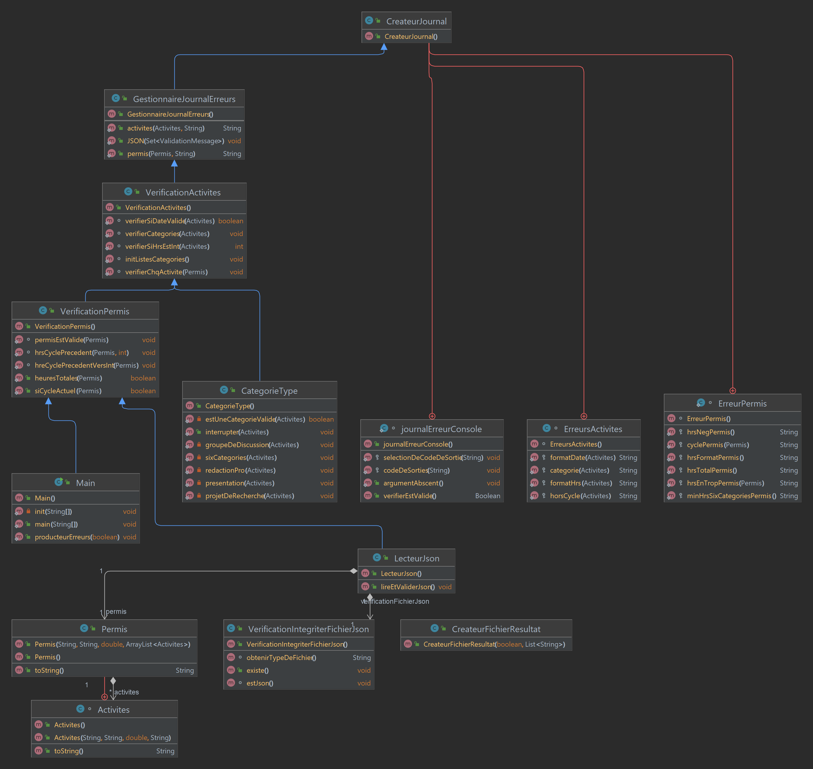

# Sprint 3 - Gestionnaire d'heures de formations - Équipe 19

Gestionnaire d'heure de formation est une librairie Java pour le Sprint #1 du cours INF-2050.

## Requis

Cette application utilise la version 19 du [JDK-Java].

## Style & Charte d'équipe

Le document [STYLE.md] offre les informations quant à nos choix stylistiques.
Le document [EQUIPE.md] offre les informations quant à notre charte d'équipe.
Le document [WORKFLOW.md] offre les informations quant à notre git workflow.
Le document [PLAN_DE_TESTS] offre les informations quant à notre plan de tests.

## Utilisation

À l'aide du fichier inf2050-a22-projet-equipe19.jar et de la commande Java, vous pourrez utiliser la librairie. 

!! Veuillez noter que notre fichier JAR n'est pas encore fonctionnel !!

Les deux arguments suivants doivent être utilisés :

1. Le nom du fichier d'entrée au format JSON.
2. Le nom du fichier de sortie au format JSON.

```bash
java -jar .\inf2050-a22-projet-equipe19.jar .\entree.json .\resultat.json
ou
java -jar ./inf2050-a22-projet-equipe19.jar ./entree.json ./resultat.json
```

### Statistiques 

Un ajout pour les statistiques pour afficher le nombre de déclaration donc :

```bash
java -jar .\inf2050-a22-projet-equipe19.jar -S .\entree.json .\resultat.json
ou
java -jar ./inf2050-a22-projet-equipe19.jar -SR ./entree.json ./resultat.json
```

Si on met le "-S", on doit afficher les statistiques. Le "-SR" les affiche également, mais sont remis à zéro.

```json
{
  "declarationTraitees": 4,
  "declarationCompletes": 0,
  "declarationIncompletesOuInvalides": 1,
  "declarationSexeHommes": 0,
  "declarationSexeFemmes": 3,
  "declarationSexeInconnu": 0,
  "nbTotalActivites": 4,
  "activitesParCategorie": {
    "atelier": 1,
    "cours": 3
  },
  "declarationValidesEtCompletes": 0,
  "declarationValidesEtCompletesArchitectes": 0,
  "declarationValidesEtCompletesPsychologues": 0,
  "declarationValidesEtCompletesGeologues": 0,
  "declarationValidesEtCompletesPodiatres": 0,
  "declarationValidesEtIncompletes": 3,
  "declarationValidesEtIncompletesArchitectes": 2,
  "declarationValidesEtIncompletesPsychologues": 0,
  "declarationValidesEtIncompletesGeologues": 0,
  "declarationValidesEtIncompletesPodiatres": 1,
  "declarationPermisInvalide": 1
}
```

#### Erreur Console : Fichier introuvable (-10)

```bash
Fichier d'entrée introuvable

Process finished with exit code -10
```

#### Erreur Console : Fichier de type invalide (-20)

```bash
Fichier de type [ text/plain ] non valide.

Process finished with exit code -20
```

#### Erreur Console : Fichier mal formé (-30)

```bash
Le fichier d'entrée n'est pas valide en raison de: Numero de Permis est un champ obligatoire mais manquant (-30)
Le fichier d'entrée n'est pas valide en raison de: Nom, Prenom ou Sexe est un champ obligatoire mais manquant (-31)
Le fichier d'entrée n'est pas valide en raison de: Ordre est un champ obligatoire mais manquant (-32)
Le fichier d'entrée n'est pas valide en raison de: Cycle est un champ obligatoire mais manquant (-33)
Le fichier d'entrée n'est pas valide en raison de: Activites est un champ obligatoire mais manquant (-34)

Process finished with exit code -30/-31/-32
```

#### Fichier de sortie : Erreur limitative (Cycle)

```json
{
  "complet": "Incomplet",
  "erreurs": [
    "Le cycle [ 2021-20423 ] ne fait pas partie du cycle actuel."
  ]
}
```

#### Fichier de sortie : Erreurs non limitatives

```json
{
  "complet": "Incomplet",
  "erreurs": [
    "Vous avez un surplus de [ 121 heures ] du cycle précédent, seulement 7 de ces heures seront prises en compte.",
    "La catégorie [ Patate ] pour l'activité [ Cours sur la déontologie ] n'est pas d'une catégorie valide. Entrée Ignorée",
    "La date [ 01-07-2022 ] pour l'activité [ Monsieur Patate est en Cavale ] n'est pas au format ISO 8601",
    "L'activité [ Mx. Patate aime le chocolat ] en date du [ 2024-01-07 ] ne fait pas partie du cycle actuel. Entrée Ignorée",
    "La catégorie [ voyage ] pour l'activité [ Visite d'établissements architecturaux ] n'est pas d'une catégorie valide. Entrée Ignorée",
    "Il manque [ 26 heures ] de formation pour completer le cycle."
  ]
}
```

## Diagrame UML



## Contribution

Il n'est pas possible pour le moment de participer à l'évolution de ce projet. Il s'agit d'un projet scolaire et est
privé. Bien sûr, les commentaires et les _Issues_ peuvent être rapportés sans problème.

## Licence

> Il s'agit d'un logiciel libre et gratuit publié dans le domaine public.
>
> Chacun est libre de copier, modifier, publier, utiliser, compiler, vendre, ou
> distribuer ce logiciel, que ce soit sous forme de code source ou de binaire compilé
> binaire compilé, dans n'importe quel but, commercial ou non, et par n'importe quel moyen.
>
> Dans les juridictions qui reconnaissent les lois sur le droit d'auteur, l'auteur ou les auteurs
> de ce logiciel dédient tous les droits d'auteur du logiciel au domaine public.
> logiciel au domaine public. Nous faisons cette dédicace pour le bénéfice
> public en général et au détriment de nos héritiers et successeurs.
> successeurs. Nous entendons que cette dédicace soit un acte manifeste de
> acte manifeste d'abandon à perpétuité de tous les droits présents et futurs sur ce logiciel
> logiciel en vertu de la loi sur le droit d'auteur.
>
> LE LOGICIEL EST FOURNI "TEL QUEL", SANS GARANTIE D'AUCUNE SORTE,
> EXPRESSE OU IMPLICITE, Y COMPRIS, MAIS SANS S'Y LIMITER, LES GARANTIES DE
> GARANTIE DE QUALITÉ MARCHANDE, D'ADÉQUATION À UN USAGE PARTICULIER ET DE NON-VIOLATION.
> EN AUCUN CAS LES AUTEURS NE POURRONT ÊTRE TENUS RESPONSABLES DE TOUTE RÉCLAMATION, DOMMAGE OU
> AUTRE RESPONSABILITÉ, QUE CE SOIT DANS LE CADRE D'UNE ACTION CONTRACTUELLE, DÉLICTUELLE OU AUTRE,
> CONTRACTUELLE, DÉLICTUELLE OU AUTRE, DÉCOULANT DE OU EN RELATION AVEC LE LOGICIEL OU
> L'UTILISATION OU D'AUTRES TRANSACTIONS DU LOGICIEL.
>
> Pour plus d'informations, veuillez vous référer à <https://unlicense.org>.

[JDK-Java]: https://www.oracle.com/java/technologies/downloads/ "Page de Téléchargement Oracle-Java-JDK"
[style.md]: STYLE.md "Guide stylistique"
[equipe.md]: EQUIPE.md "Charte d'équipe"
[workflow.md]: WORKFLOW.md "git workflow"
[plan_de_tests]: PLAN_DE_TESTS.md "Plan de tests"
