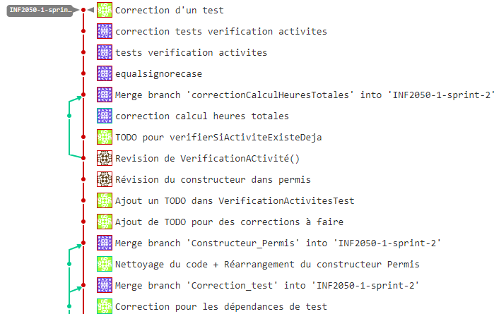

## UQAM - INF2050 Groupe 30 - Équipe 19
###Projet de session - Automne 2022 - Workflow

Pour améliorer l'efficacité de travail en équipe, nous avons créé trois `branches`
au sein du projet : main, dev et INF2050-1-sprint-2.

La branche `main` est la version définitive du projet. Lorsqu'on est sûr que tous fonctionne
correctement, c'est là qu'on rassemble tous les autres branches.

La branche `dev` c'est lorsqu'on atteint une version stable du projet qu'on est prêt à délivrer, ceci
sera ensuite intégré dans la branche main.

La branche `INF2050-1-sprint-2` est une copie de la main sur laquelle on peut modifier sans
craindre de changer le projet lui-même. Tous les nouveaux fonctionnements seront commités dans cette
branche.

La manière dont on procède lorsque que quelqu'un veut ajouter une nouvelle fonctionnalité :
Il faut créer une nouvelle branche pour ce changement puis, ajouter les modifications localement en faisant un `commit`.
Ensuite, partager avec les autres membres avec un `push`. Par la suite, quand c'est vérifié par un autre
membre on l'ajoute à la branche `INF2050-1-sprint-2`.

https://gitlab.info.uqam.ca/inf2050-equipe19/inf2050-a22-projet-equipe19/-/network/INF2050-1-sprint-2